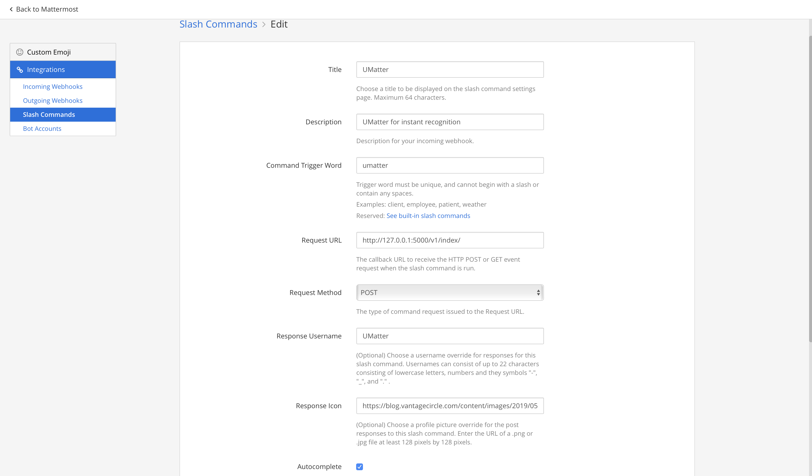

# UMatter Bot
UMatter - A bot for instant appreciation via Mattermost

## Project Summary:

This project aims to make mattermost more rewarding by appreciating peers in Mattermost channels right when and where great work is happening.

## Hackathon Proposal:
This is a submission to Mattermost Hackathon.

Hackathon Proposal can be found here - [Proposal](documentation/ppt.pptx)

Note: One change in the proposal -  Negative points are not implemented. After some thinking, awarding negative points is a bad way of communication. Hence, this feature was not implemented.

## Features:
(Click on the feature for more info)

* [**Give Appreciation**](documentation/features/appreciation.md) - Quickly give appreciation to the user right there in the channel itself.
* [**Create a Company Value**](documentation/features/value.md) - Create a company value as an emoji and tag to the appreciation posts 
* [**Top Peers**](documentation/features/top.md) - Users can see top performing teammates in their respective channels wrt to a date range
* [**Self Statistics**](documentation/features/user.md) - See the statistics about yourself
* [**Channel Statistics**](documentation/features/channel.md) - See the statistics in a public/private channel

## Development:

### Setting up the environment 

This is the ***manual way*** of setting up the environment and the app

* **Programming Language:** Python 3.7
* **Database:** MySQL 8.0
* **Mattermost Version:** v5.20
* **Virtual Environment**
  * Create an anaconda environment. 
  * Activate the conda environment.
  * Run the command 
  `pip install requirements.txt`
* Create a Bot Account in Mattermost with ***system admin*** access. Copy the Token and assign it to the corresponding config class MM_BOT_TOKEN. Follow the image below.

* Similarly if you are running the app in local, register a slash command with the url `http://127.0.0.1:5000/v1/index/`. Follow the image below.

* **Configuration Variables**
  * *Flask Settings*  
    
  | Variable Name | Possible Values | Purpose  |
  | --: | :-- | :-- |
  |APP_NAME| u-matter rest service| Name of the application|
  |APP_PORT| 5000 | port where the flask app runs|
  |APP_HOST| localhost | host url for the flask app|
  |DEBUG| True/False| To print the debug logs|
  
  * *Mysql Settings*

  | Variable Name | Possible Values | Purpose  |
  | --: | :-- | :-- |
  |MYSQL_HOST| localhost| MySql host url|
  |MYSQL_USER| root | MySql user name|
  |MYSQL_PASSWORD| root | MySql User Password|
  |MYSQL_DB | umatter | MySql Database to Use|
  |MYSQL_PORT | 3306 | MySql Port|

  * *Mattermost settings*

  | Variable Name | Possible Values | Purpose  |
  | --: | :-- | :-- |
  |DAILY_POINT_LIMIT| 10 | Max points given by an user per day|
  |PER_TRANSACTION_POINT_LIMIT| 5 |Max points given by an user for every appreciation|
  |WEEKLY_THRESHOLD| 40 |Weekly threshold for reward. Anyone crossing this value for 7 days are considered for reward|
  |MM_SCHEME|http/https|To use SSL encryption for MM connectivity or not|
  |MM_URL|localhost| Mattermost host|
  |MM_PORT|8065| Mattermost port|
  |MM_BOT_TOKEN|wegffdasdfgrearfdgb| Token once you create a bot account on MM|
  |MM_SLASH_TOKEN|sefgrrwefgrq3wreg| Token once you register a slash command in Mattermost|

  * *Log File Path*
    * LOG_FILE_PATH = "event_logs.log"
 * All of the above configuration variables are in the `config.py`. You need to set the values accordingly.
 * `default` configuration is set to production. In order to change it, set the environment variable `FLASK_CONFIG` to `development` or `testing`
 * In Order to run the application manually,
 `python run.py`
 * If everything works fine, you should see the logs printing as `Serving on http://0.0.0.0:5000`

#### Docker
This is the ***dockerized way*** of setting up the environment and the app.

* Here, set the mattermost url, port, bot token, slash command token. 
* Run the command `docker-compose up`
* If everything works fine, you should be able to access the slash command in your mattermost UI.

### Troubleshooting Common Problems:
1. Not able to access mattermost API - Set the Bot Token correctly
2. Not able to connect to database - Check if the mysql settings in the config are correct

### Enhancements Needed:
* Automate the creation of the bot account
* Increase the statistics of channel
* Better format messages

Pending Tasks:
1. Unit testing
2. behavioral testing
3. Integration testing
4. Coverage

A big thanks to Christian Vaelor for his mattermost driver.