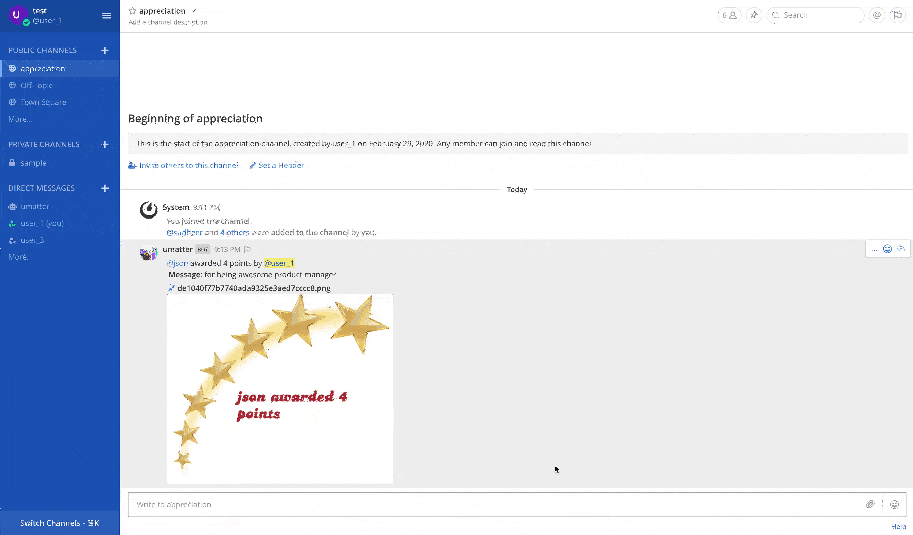
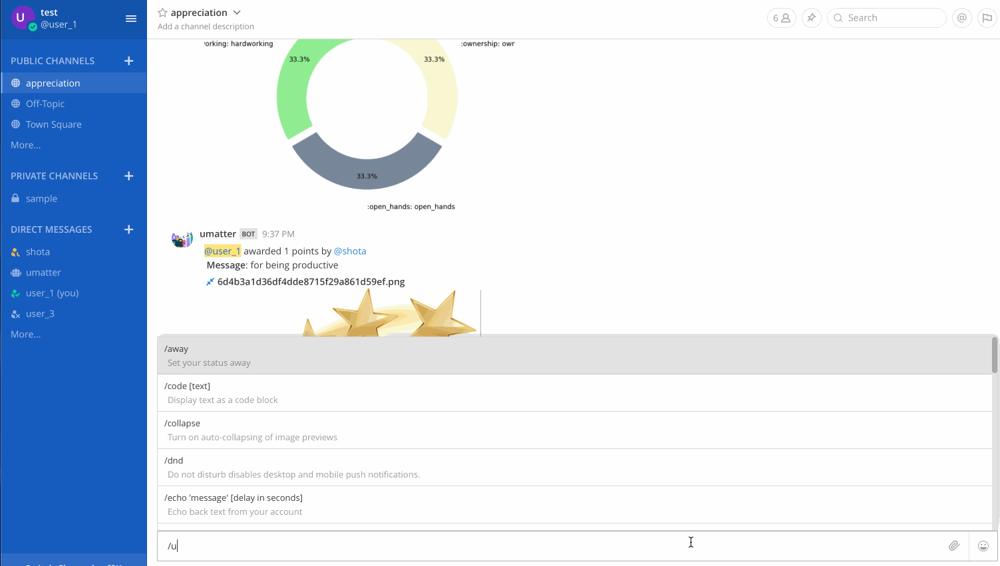
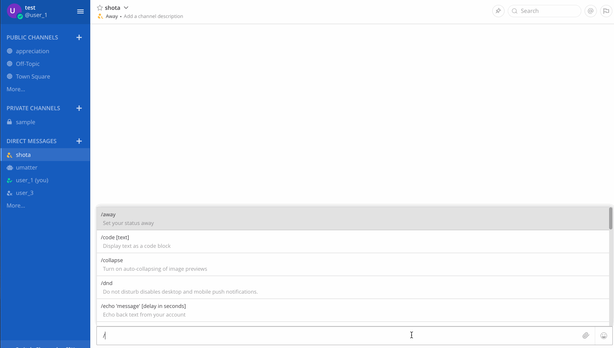
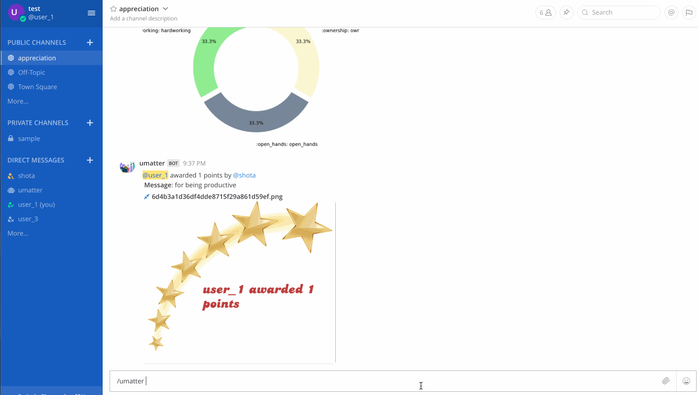

# Appreciation

UMatter makes it easier to give appreciation in the form of points in mattermost channels right where great work is happening.

For every appreciation, an appreciation image post is generated on the fly with the name of the teammate/peer who is receiving the points along with the number of points awarded.

Anyone can appreciate anyone in the public/private channels but not in direct message channels. Hence, to give appreciation also we have to have some ground rules. The rules are as follows:

1. Every user can give max points per appreciation as defined by the configuration variable `PER_TRANSACTION_POINT_LIMIT`

2. Every user can give max points per day as defined by the configuration variable `DAILY_POINT_LIMIT`

3. No user can give appreciation in a direct message channel

4. No user can give appreciation points to himself/herself

5. No negative points are allowed

Format to give the appreciation is as follows:

`/umatter @username ++ for helping me out` ---> one point appreciation  
`/umatter @username 3++ for writing the test suite` ---> more points appreciation

