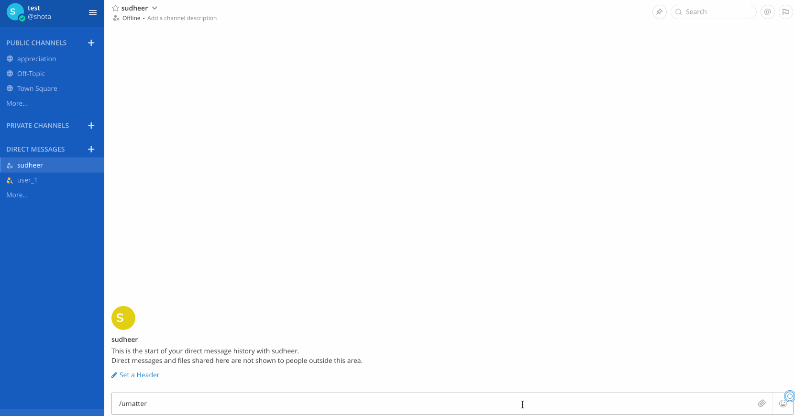

# Top Peers 

Knowing Top peers in a channel will always help in recognizing and rewarding the most hard-working person in a channel. Consider a sprint, it's two weeks. Hence, a start and end date is given in order to recognize and reward the appropriate peers for the sprint.

The format for getting top peers is as follows  
`/umatter top peers start_date end_date`  
start_date and end_date to be in yyyy-mm-dd format.  
For ex. `/umatter top peers 2020-02-12 2020-02-24`

1. This command has to be issued from a public/private channel. 

2. Issuing this slash command will give the top 1st, 2nd & 3rd peers with their awarded medals. (These are medals are subjected to the daterange)

3. If the difference between start_date and end_date is 7, it is counted as a week and hence, the configuration variable `WEEKLY_THRESHOLD` will kick in. This says that any peer who has a sum of points greater than the threshold is worthy of reward. But teammates who went out of their way and earned more points will be given medals.

Looks like no one got past the weekly threshold of 40