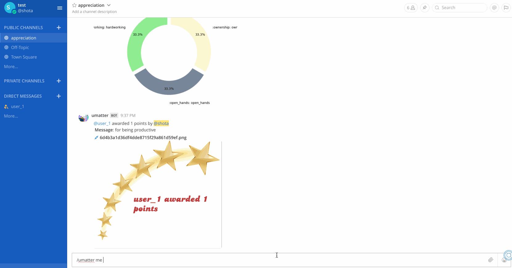
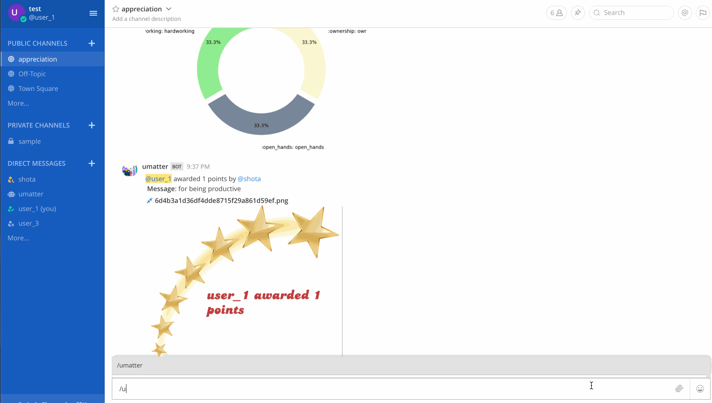
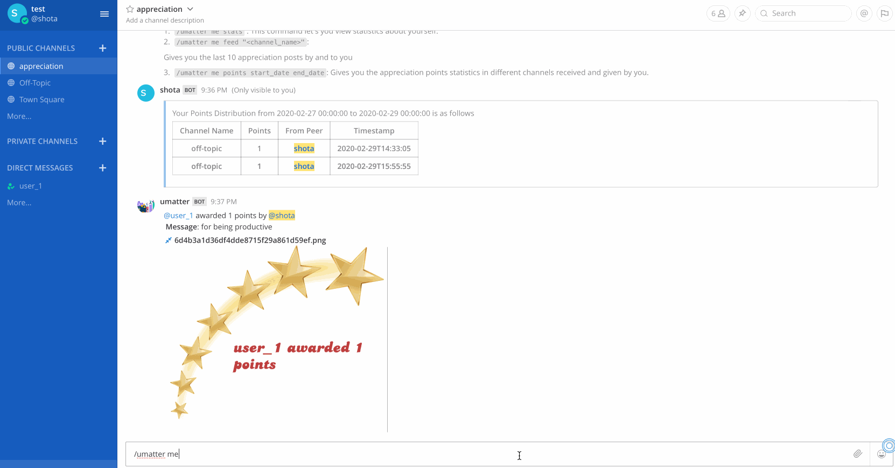

# User Statistics

Every user needs to know about his points. 

Format for user related queries are as follows  
`/umatter me stats` :  
This command let's you view statistics about yourself.  
Statistics information are as follows:  
* Number of posts where you were tagged in (either at giving or receiving end)
* Emojis tagged to the posts where you were tagged in
* User Name
* Total Appreciation Posts (by and to you)
* Total Points Received from Peers
* Total Points Given to Peers
* Total Appreciation Posts by you
* Total Appreciation Posts to you

`/umatter me feed "<channel_name>"` :  
Gives you the last 10 appreciation posts by and to you in the channel name given by you.

`/umatter me points start_date end_date` :  
Gives you the appreciation points statistics in different channels given by you.

