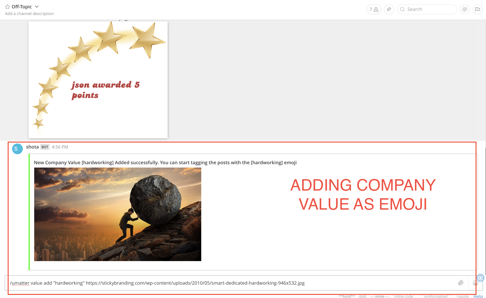

# Company Value

Every company has it's set of values. Company encourages every employee to follow it's values. But recognizing the people who follow those values is also difficult. Hence, create an emoji that depicts the company value and tag for them for the appropriate appreciation posts.

Format to add a company value:
`/umatter value add "value_name" <image_url>`
Ensure no special characters other than dot(.), dash(-), underscore(-) are in the value name. Supported image urls should end in png, jpg, jpeg, gif.
For ex. `/umatter value add "consistency" http://<image_url>.png`

